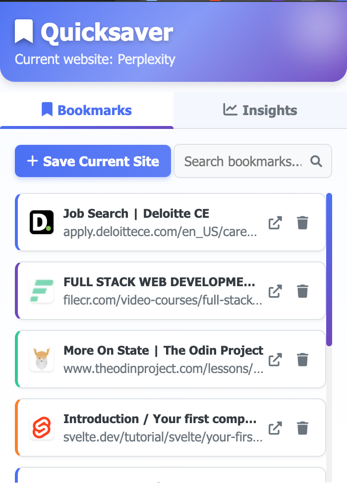

# QuickSaver Chrome Extension

QuickSaver is a Chrome extension that helps you track and save websites you visit, providing insights about your browsing habits.

## Features

- **Website Tracking**: Automatically identifies and records websites you visit
- **Bookmark Management**: Save your favorite websites with a single click
- **Daily Insights**: View statistics about your browsing activity for the current day
- **Search Functionality**: Easily search through your saved bookmarks
- **Clean UI**: Modern and intuitive user interface with animations

## Screenshots

## Installation

### From Source Code

1. Clone this repository or download the ZIP file
2. Open Chrome and navigate to `chrome://extensions/`
3. Enable "Developer mode" in the top-right corner
4. Click "Load unpacked" and select the extension directory
5. The QuickSaver extension should now be installed and visible in your toolbar

## Usage

- Click on the QuickSaver icon in your Chrome toolbar to open the extension popup
- The current website will be displayed at the top
- Click "Save Current Site" to add the current website to your bookmarks
- Use the tabs to switch between "Bookmarks" and "Insights" views
- In the Bookmarks tab, you can search, visit, or delete your saved bookmarks
- In the Insights tab, you can view statistics about your browsing activity for the current day

## Privacy

QuickSaver respects your privacy:
- All data is stored locally on your device
- No data is sent to external servers
- You can delete your browsing history and bookmarks at any time

## License

This project is licensed under the MIT License - see the LICENSE file for details.

## Contributing

Contributions are welcome! Feel free to submit a pull request or open an issue if you have any suggestions or find any bugs. 
